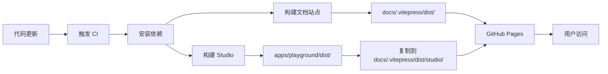

# Studio Deployment Implementation Summary

## 问题描述 (Problem Statement)
如何把现有的 Studio 发布到官网，提供给所有人试用和体验。

## 解决方案 (Solution)

### 1. 核心改动 (Core Changes)

#### A. Vite 配置 (`apps/playground/vite.config.ts`)
- 添加了生产环境的 `base` 路径配置
- 在生产模式下，所有资源路径自动添加 `/studio/` 前缀
- 保持开发模式使用根路径 `/`，避免影响本地开发体验

```typescript
base: process.env.NODE_ENV === 'production' ? '/studio/' : '/',
```

#### B. GitHub Actions 工作流 (`.github/workflows/deploy-docs.yml`)
增加了 Studio 的构建和部署步骤：
1. **触发条件扩展** - 监听 playground、packages、docs 的更新
2. **构建 Studio** - 使用生产环境构建 playground 应用
3. **集成部署** - 将 Studio 复制到文档站点的 `/studio/` 子目录
4. **统一部署** - 与文档站点一起部署到 GitHub Pages

### 2. 用户访问路径 (Access Points)

#### A. 主页 CTA (`docs/index.md`)
- 将 "Try Studio Now" 设为主要行动按钮
- 位于英雄区域的首要位置
- 添加了专门的 Studio 体验章节

#### B. 顶部导航 (`docs/.vitepress/config.mts`)
- 在导航栏添加 "Studio" 链接
- 位于显著位置，方便用户快速访问

#### C. 指南文档 (`docs/guide/studio.md`)
创建了完整的 Studio 使用指南，包含：
- 功能特性介绍
- 快速入门教程
- 键盘快捷键说明
- 使用场景和最佳实践
- 常见问题解答

### 3. 文档更新 (Documentation)

#### A. 中文部署指南 (`STUDIO_DEPLOYMENT.zh-CN.md`)
提供了完整的中文部署文档，包括：
- 部署架构说明
- 工作流程详解
- 本地测试方法
- 故障排查指南
- 维护说明

#### B. README 更新
- 在主 README 中添加了 Studio 在线体验链接
- 提供了醒目的试用入口

## 部署效果 (Deployment Result)

### 访问地址
Studio 将在以下地址提供服务：
```
https://objectql.github.io/objectui/studio/
```

### 用户体验
用户可以通过多种方式访问：
1. 直接访问上述 URL
2. 通过官网首页的 "Try Studio Now" 按钮
3. 通过顶部导航栏的 "Studio" 链接
4. 通过指南文档中的链接

### 功能特性
Studio 提供的完整功能：
- ✅ 可视化拖放设计器
- ✅ 实时 JSON 编辑器
- ✅ 三种视图模式（设计/预览/代码）
- ✅ 响应式预览（桌面/平板/移动）
- ✅ 多种示例模板
- ✅ JSON 导出和复制功能
- ✅ 撤销/重做历史记录
- ✅ 键盘快捷键支持

## 技术实现细节 (Technical Details)

### 文件结构
```
objectui/
├── apps/playground/          # Studio 应用源代码
│   ├── src/                  # 源代码
│   ├── vite.config.ts        # ✨ 修改：添加 base 配置
│   └── dist/                 # 构建输出（不提交）
├── docs/                     # 文档站点
│   ├── .vitepress/
│   │   ├── config.mts        # ✨ 修改：添加导航
│   │   └── dist/             # 文档构建输出
│   │       └── studio/       # 🎯 Studio 部署位置
│   ├── guide/
│   │   └── studio.md         # ✨ 新增：Studio 指南
│   └── index.md              # ✨ 修改：添加 CTA
├── .github/workflows/
│   └── deploy-docs.yml       # ✨ 修改：集成 Studio 构建
├── STUDIO_DEPLOYMENT.zh-CN.md # ✨ 新增：中文部署指南
└── README.md                 # ✨ 修改：添加 Studio 链接
```

### 构建流程


### 资源路径处理
- **开发环境**: `base: '/'` → 资源路径如 `/assets/index.js`
- **生产环境**: `base: '/studio/'` → 资源路径如 `/studio/assets/index.js`
- Vite 自动处理所有相对路径，确保在嵌套部署时正常工作

## 测试验证 (Testing)

### 本地测试结果
✅ 依赖安装成功
✅ 核心包构建成功
✅ Playground 构建成功（生产模式）
✅ 资源路径正确（包含 `/studio/` 前缀）
✅ 文档站点构建成功
✅ Studio 集成到文档输出目录成功

### 构建输出验证
```html
<!-- apps/playground/dist/index.html -->
<script type="module" src="/studio/assets/index-_-asvLOs.js"></script>
<link rel="stylesheet" href="/studio/assets/index-D9iW6WaR.css">
```
✅ 路径正确包含 `/studio/` 前缀

## 后续维护 (Maintenance)

### 更新 Studio
1. 修改 `apps/playground/src/` 中的代码
2. 提交并推送到 `main` 分支
3. GitHub Actions 自动构建和部署
4. 几分钟后更新生效

### 添加新示例
编辑 `apps/playground/src/data/examples.ts`，添加新的示例模板

### 监控部署
- 查看 GitHub Actions 工作流日志
- 访问 GitHub Pages 设置页面查看部署状态
- 测试实际访问 URL

## 影响分析 (Impact Analysis)

### 用户体验提升
- ✅ 用户可以直接在线体验 Object UI Studio
- ✅ 无需本地安装即可学习和试用
- ✅ 降低了上手门槛
- ✅ 提供了直观的功能展示

### 项目推广
- ✅ 提供了实际可用的演示环境
- ✅ 增加了项目的可见性和易用性
- ✅ 帮助潜在用户快速理解产品价值

### 开发效率
- ✅ 自动化部署，无需手动操作
- ✅ 与现有文档站点集成，统一管理
- ✅ 保持了开发环境和生产环境的一致性

## 总结 (Summary)

本次实现完成了以下目标：
1. ✅ 配置了 Studio 的生产环境构建
2. ✅ 集成了自动化部署流程
3. ✅ 提供了多个用户访问入口
4. ✅ 创建了完整的使用文档
5. ✅ 保证了构建和部署的可靠性

Studio 将在合并到 `main` 分支后自动部署到官网，为所有用户提供在线试用和体验的机会。
