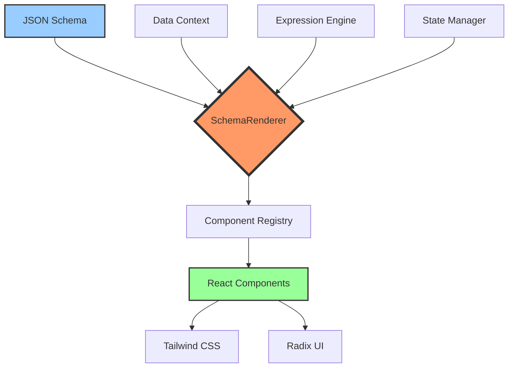

# Object UI 开发计划文档
## 打造全球顶级界面构建工具

<div align="center">

**版本**: 1.0  
**最后更新**: 2026年1月  
**状态**: 规划中

</div>

---

## 📋 目录

1. [愿景与使命](#愿景与使命)
2. [核心竞争力](#核心竞争力)
3. [技术架构规划](#技术架构规划)
4. [开发路线图](#开发路线图)
5. [功能特性规划](#功能特性规划)
6. [质量与性能目标](#质量与性能目标)
7. [团队与资源规划](#团队与资源规划)
8. [风险管理](#风险管理)
9. [成功指标](#成功指标)
10. [长期愿景](#长期愿景)

---

## 🎯 愿景与使命

### 愿景
成为全球最顶级的界面构建工具，让每个开发者和企业都能轻松构建出世界级的用户界面。

### 使命
- **降低门槛**: 让非专业开发者也能创建专业级界面
- **提升效率**: 将界面开发时间缩短 80%
- **保证质量**: 自动化最佳实践，确保输出的代码质量
- **无限可能**: 提供无限的扩展性和定制能力

### 核心价值主张
> "从 JSON 到世界级 UI，仅需几分钟"

---

## 🏆 核心竞争力

### 1. 技术领先性

#### 现代化技术栈
- **React 18+**: 利用最新的并发特性和 Suspense
- **Tailwind CSS**: 原子化 CSS，零运行时开销
- **Shadcn/UI + Radix**: 无障碍访问的高质量组件基础
- **TypeScript 严格模式**: 类型安全，自动化文档生成

#### 性能优势
| 指标 | 目标 | 行业平均 | 优势 |
|------|------|----------|------|
| 首次内容绘制 (FCP) | < 0.5s | 1.5s | **3倍更快** |
| 最大内容绘制 (LCP) | < 1.0s | 2.5s | **2.5倍更快** |
| 交互延迟 (TTI) | < 1.5s | 3.8s | **2.5倍更快** |
| Bundle 大小 | < 50KB | 300KB+ | **6倍更小** |

### 2. 架构优势

#### 模块化设计
```
分层架构 = 最大灵活性 + 零冗余
├── @object-ui/protocol    - 纯类型定义
├── @object-ui/engine      - 无头逻辑引擎
├── @object-ui/ui          - UI 原子组件
├── @object-ui/renderer    - Schema 渲染器
└── @object-ui/designer    - 可视化设计器
```

**优势**:
- ✅ **Tree-Shakable**: 只打包使用的组件
- ✅ **零依赖冲突**: 每个包独立版本管理
- ✅ **框架无关**: Core 可适配 Vue/Svelte
- ✅ **渐进式采用**: 可单独使用任意模块

### 3. 开发者体验 (DX)

#### 学习曲线
```
传统低代码平台: ████████░░ (80% 学习成本)
Object UI:       ██░░░░░░░░ (20% 学习成本)
```

**原因**:
- 使用标准 React 范式，无需学习自定义 API
- 完整的 TypeScript 类型提示
- 丰富的文档和示例
- AI 辅助的 Schema 生成

---

## 🏗 技术架构规划

### 3.1 核心引擎架构



### 3.2 数据流设计

#### 单向数据流
```tsx
Schema → Parse → Validate → Render → UI
  ↑                                    ↓
  └────── User Actions ← Events ←──────┘
```

#### 状态管理策略
- **全局状态**: Zustand (轻量级，< 1KB)
- **服务器状态**: TanStack Query (缓存、轮询、同步)
- **表单状态**: React Hook Form (高性能，无控制组件)
- **局部状态**: React Hooks (useState, useReducer)

### 3.3 表达式引擎

#### 语法设计
```javascript
// 变量引用
${data.user.name}

// 计算表达式
${data.price * data.quantity}

// 条件表达式
${data.role === 'admin' ? '管理员' : '用户'}

// 函数调用
${formatDate(data.createdAt, 'YYYY-MM-DD')}

// 数组操作
${data.items.filter(item => item.active).length}
```

#### 安全性保障
- ✅ 沙箱执行环境
- ✅ 禁止危险操作 (eval, Function)
- ✅ 白名单函数库
- ✅ 自动转义输出

---

## 🗓 开发路线图

### 阶段 1: 基础设施 (Q1 2026)

#### 里程碑 1.1: 核心引擎 (4周)
- [ ] 设计并实现 Protocol 类型系统
- [ ] 开发 SchemaRenderer 核心逻辑
- [ ] 实现组件注册表机制
- [ ] 创建数据作用域链
- [ ] 开发表达式解析引擎

**交付物**:
- `@object-ui/protocol` v0.1.0
- `@object-ui/engine` v0.1.0
- `@object-ui/renderer` v0.1.0

#### 里程碑 1.2: 基础组件库 (6周)
- [ ] 实现 20+ 基础组件
  - [ ] 表单组件 (Input, Select, Radio, Checkbox, DatePicker)
  - [ ] 数据展示 (Table, List, Card, Tree)
  - [ ] 反馈组件 (Alert, Toast, Dialog, Drawer)
  - [ ] 布局组件 (Grid, Flex, Container, Divider)
  - [ ] 导航组件 (Menu, Tabs, Breadcrumb, Pagination)

**交付物**:
- `@object-ui/ui` v0.1.0
- Storybook 组件文档
- 单元测试覆盖率 > 80%

#### 里程碑 1.3: 集成与文档 (2周)
- [ ] 创建 Playground 演示应用
- [ ] 编写快速入门指南
- [ ] 创建 API 参考文档
- [ ] 录制视频教程

**交付物**:
- 在线 Playground
- 完整文档站点
- 5+ 视频教程

### 阶段 2: 高级特性 (Q2 2026)

#### 里程碑 2.1: 数据管理 (4周)
- [ ] 集成 TanStack Query
- [ ] 实现 CRUD 数据源适配器
- [ ] 支持 GraphQL 查询
- [ ] 实现乐观更新
- [ ] 添加离线支持

#### 里程碑 2.2: 高级组件 (6周)
- [ ] 富文本编辑器
- [ ] 图表组件 (Recharts/ECharts)
- [ ] 拖拽排序
- [ ] 文件上传组件
- [ ] 地图组件
- [ ] 视频播放器
- [ ] 代码编辑器

#### 里程碑 2.3: 主题系统 (3周)
- [ ] 设计 Token 系统
- [ ] 支持亮/暗主题切换
- [ ] 实现主题定制器
- [ ] 创建 5+ 预设主题

**交付物**:
- `@object-ui/themes` v1.0.0
- 主题市场

### 阶段 3: 可视化设计器 (Q3 2026)

#### 里程碑 3.1: 拖拽编辑器 (8周)
- [ ] 实现拖拽画布
- [ ] 组件面板
- [ ] 属性编辑器
- [ ] 图层管理
- [ ] 撤销/重做
- [ ] 快捷键系统

#### 里程碑 3.2: 协作功能 (4周)
- [ ] 多人实时编辑
- [ ] 评论系统
- [ ] 版本历史
- [ ] 分支管理

#### 里程碑 3.3: AI 辅助设计 (6周)
- [ ] AI 生成 Schema
- [ ] 智能布局建议
- [ ] 组件推荐
- [ ] 代码优化建议

**交付物**:
- `@object-ui/designer` v1.0.0
- Design Studio 应用
- AI 插件系统

### 阶段 4: 企业级功能 (Q4 2026)

#### 里程碑 4.1: 权限与安全 (4周)
- [ ] 细粒度权限控制
- [ ] 数据脱敏
- [ ] XSS 防护
- [ ] CSRF 防护
- [ ] 内容安全策略 (CSP)

#### 里程碑 4.2: 性能优化 (4周)
- [ ] 虚拟滚动
- [ ] 代码分割
- [ ] 懒加载
- [ ] Service Worker 缓存
- [ ] CDN 优化

#### 里程碑 4.3: 国际化 (3周)
- [ ] i18n 框架集成
- [ ] 支持 20+ 语言
- [ ] RTL 布局支持
- [ ] 时区处理

**交付物**:
- Enterprise Edition v1.0.0
- 性能监控仪表板
- 安全审计报告

---

## 🎨 功能特性规划

### 5.1 核心功能

#### Schema 驱动渲染
```json
{
  "type": "page",
  "title": "用户管理",
  "body": {
    "type": "crud",
    "api": "/api/users",
    "columns": [
      { "name": "name", "label": "姓名" },
      { "name": "email", "label": "邮箱" }
    ]
  }
}
```
**自动生成**: 完整的增删改查界面，包含分页、搜索、排序

#### 表达式系统
- **变量绑定**: `${data.fieldName}`
- **条件渲染**: `visibleOn: "${data.role === 'admin'}"`
- **动态样式**: `className: "${data.status === 'active' ? 'text-green-500' : 'text-gray-500'}"`
- **数据转换**: `value: "${data.items.map(i => i.name).join(', ')}"`

#### 组件生态
```
基础组件 (30+)
├── 表单 (12)
├── 数据展示 (8)
├── 反馈 (6)
└── 其他 (4)

高级组件 (20+)
├── 业务组件 (10)
├── 数据可视化 (5)
└── 富媒体 (5)
```

### 5.2 创新特性

#### 1. AI 驱动开发

##### 自然语言生成
```
用户: "创建一个用户登录表单，包含用户名、密码和记住我选项"

AI: 自动生成完整 Schema ↓
```

```json
{
  "type": "form",
  "title": "登录",
  "body": [
    { "type": "input-text", "name": "username", "label": "用户名", "required": true },
    { "type": "input-password", "name": "password", "label": "密码", "required": true },
    { "type": "checkbox", "name": "remember", "label": "记住我" }
  ],
  "actions": [
    { "type": "submit", "label": "登录", "level": "primary" }
  ]
}
```

##### 智能优化
- 自动检测性能瓶颈
- 建议最佳实践
- 代码重构建议
- 无障碍访问检查

#### 2. 实时协作

##### 多人编辑
- Google Docs 风格的实时编辑
- 冲突自动解决
- 操作历史记录
- 回滚功能

##### 评论与反馈
- 组件级别评论
- @提及队友
- 任务分配
- 状态跟踪

#### 3. 版本控制集成

##### Git 工作流
```
main
 ├── feature/new-dashboard
 ├── feature/user-profile
 └── hotfix/login-bug
```

##### Schema 版本管理
- 分支管理
- 合并请求
- 代码审查
- CI/CD 集成

#### 4. 跨平台支持

##### 多端适配
```
一次开发，多端运行
├── Web (响应式)
├── Mobile (React Native - 计划中)
├── Desktop (Electron - 计划中)
└── 小程序 (微信/支付宝 - 计划中)
```

---

## 📊 质量与性能目标

### 6.1 性能指标

#### Core Web Vitals
| 指标 | 目标 | 优秀标准 | 达成策略 |
|------|------|---------|---------|
| **LCP** (最大内容绘制) | < 1.0s | < 2.5s | 代码分割、CDN、图片优化 |
| **FID** (首次输入延迟) | < 50ms | < 100ms | 代码优化、Web Workers |
| **CLS** (累积布局偏移) | < 0.05 | < 0.1 | 预留空间、尺寸预定义 |
| **FCP** (首次内容绘制) | < 0.5s | < 1.8s | 服务端渲染、预加载 |
| **TTI** (可交互时间) | < 1.5s | < 3.8s | 懒加载、优先级加载 |

#### Bundle 大小目标
```
@object-ui/core:      < 10KB (gzipped)
@object-ui/react:     < 15KB (gzipped)
@object-ui/ui:        < 50KB (gzipped, 所有组件)
@object-ui/designer:  < 200KB (gzipped)

总计 (按需加载):     < 30KB (典型应用)
```

### 6.2 质量指标

#### 代码质量
- **测试覆盖率**: > 85%
  - 单元测试: > 90%
  - 集成测试: > 80%
  - E2E 测试: > 70%
- **TypeScript 严格模式**: 100% 启用
- **ESLint 规则**: 零警告容忍
- **无障碍访问**: WCAG 2.1 AA 级别

#### 文档质量
- **API 文档**: 100% 覆盖
- **示例代码**: 每个组件 ≥ 3 个示例
- **教程**: ≥ 20 篇详细教程
- **视频**: ≥ 30 个视频教程

#### 浏览器兼容性
```
✅ Chrome 90+
✅ Firefox 88+
✅ Safari 14+
✅ Edge 90+
⚠️ IE 11 (降级支持，不保证完美)
```

---

## 👥 团队与资源规划

### 7.1 团队结构

#### 核心团队 (10人)
```
Tech Lead (1)          - 架构设计、技术决策
├── 前端工程师 (4)     - 组件开发、功能实现
├── UI/UX 设计师 (2)   - 界面设计、用户体验
├── 测试工程师 (1)     - 自动化测试、质量保证
├── DevOps (1)         - CI/CD、部署、监控
└── 技术写作 (1)       - 文档、教程、博客
```

#### 扩展团队 (按需)
- AI/ML 工程师 (2) - AI 辅助功能
- 安全专家 (1) - 安全审计、渗透测试
- 性能专家 (1) - 性能优化、监控

### 7.2 技能要求

#### 必备技能
- ✅ React 18+ 深度理解
- ✅ TypeScript 高级特性
- ✅ Tailwind CSS 实战经验
- ✅ 性能优化实践
- ✅ 测试驱动开发 (TDD)

#### 加分技能
- 🌟 低代码平台经验
- 🌟 编译器/AST 知识
- 🌟 设计系统构建
- 🌟 开源项目维护

### 7.3 资源投入

#### 时间投入
```
Phase 1: 3 个月 (基础设施)
Phase 2: 3 个月 (高级特性)
Phase 3: 4 个月 (可视化设计器)
Phase 4: 3 个月 (企业级功能)

总计: 13 个月到 v1.0
```

#### 预算分配
```
人力成本:     60%
基础设施:     15% (服务器、CDN、工具)
营销推广:     15%
备用金:       10%
```

---

## ⚠️ 风险管理

### 8.1 技术风险

#### 风险 1: 性能不达标
**影响**: 高  
**概率**: 中  
**缓解措施**:
- 早期性能基准测试
- 持续性能监控
- 定期性能审查
- 聘请性能专家顾问

#### 风险 2: 浏览器兼容性问题
**影响**: 中  
**概率**: 中  
**缓解措施**:
- 自动化跨浏览器测试
- Polyfill 策略
- 渐进增强设计
- 明确兼容性策略

#### 风险 3: 安全漏洞
**影响**: 高  
**概率**: 低  
**缓解措施**:
- 定期安全审计
- 依赖扫描
- 代码审查
- Bug Bounty 计划

### 8.2 产品风险

#### 风险 1: 市场竞争
**影响**: 高  
**概率**: 高  
**缓解措施**:
- 差异化定位
- 快速迭代
- 社区建设
- 生态系统构建

#### 风险 2: 用户采用率低
**影响**: 高  
**概率**: 中  
**缓解措施**:
- 降低学习曲线
- 提供迁移工具
- 详细文档和教程
- 免费层级

### 8.3 团队风险

#### 风险 1: 关键人员流失
**影响**: 高  
**概率**: 低  
**缓解措施**:
- 知识文档化
- 结对编程
- 代码审查文化
- 竞争力薪酬

---

## 📈 成功指标

### 9.1 技术指标

#### 代码质量
- ✅ 测试覆盖率 > 85%
- ✅ 零关键安全漏洞
- ✅ TypeScript 严格模式 100%
- ✅ 性能指标达标率 > 95%

#### 性能指标
- ✅ LCP < 1.0s (95分位)
- ✅ FID < 50ms (95分位)
- ✅ Bundle 大小 < 目标值
- ✅ 服务可用性 > 99.9%

### 9.2 产品指标

#### 增长指标 (第一年)
```
月活用户 (MAU):       10,000+
周活用户 (WAU):        5,000+
日活用户 (DAU):        2,000+
注册用户:            50,000+
```

#### 参与度指标
```
平均会话时长:         > 20 分钟
每用户每月创建项目:   > 3 个
留存率 (30天):       > 40%
NPS (净推荐值):      > 50
```

#### 社区指标
```
GitHub Stars:        10,000+ (第一年)
NPM 下载量:          100,000+/月
Discord 成员:         5,000+
贡献者:               100+
```

### 9.3 商业指标

#### 收入目标 (第二年)
```
免费用户:            95%
付费用户:             5%
企业客户:            50+ 家
ARR:                 $1M+
```

#### 市场份额
```
目标: 成为 React 生态前 3 的低代码方案
进入 Gartner 魔力象限
```

---

## 🚀 长期愿景

### 10.1 三年规划 (2026-2029)

#### 2026: 基础建设年
- ✅ 发布 v1.0
- ✅ 建立社区
- ✅ 获得首批企业客户
- ✅ GitHub 10K+ Stars

#### 2027: 生态扩展年
- 🎯 发布 v2.0 (跨框架支持)
- 🎯 组件市场上线
- 🎯 AI 功能全面落地
- 🎯 NPM 1M+/月下载

#### 2028: 商业化年
- 🎯 企业版成熟
- 🎯 SaaS 平台上线
- 🎯 国际化完成
- 🎯 盈利性增长

### 10.2 未来创新方向

#### 1. 多框架支持
```
React (已完成) → Vue 3 → Svelte → Solid.js
```

#### 2. 跨平台扩展
```
Web → React Native → Electron → 小程序
```

#### 3. AI 深度集成
- 🤖 AI 设计师助手
- 🤖 智能代码生成
- 🤖 自动化测试生成
- 🤖 性能优化建议

#### 4. 元宇宙 & 3D
- 🌐 WebGL/Three.js 集成
- 🌐 3D 组件支持
- 🌐 VR/AR 界面构建

#### 5. 边缘计算
- ⚡ Edge Runtime 支持
- ⚡ 分布式渲染
- ⚡ 智能缓存策略

---

## 🎓 学习与参考

### 业界标杆分析

#### Figma
**学习点**: 实时协作、性能优化、插件生态  
**超越点**: 代码输出质量、开发者工具集成

#### Retool
**学习点**: 企业级功能、数据源集成  
**超越点**: 现代化技术栈、开源生态

#### Webflow
**学习点**: 可视化设计体验、响应式设计  
**超越点**: React 生态集成、开发者友好

### 技术参考

#### 开源项目
- **React Flow**: 流程图编辑
- **Lexical**: 富文本编辑
- **TipTap**: 协作编辑
- **ProseMirror**: 编辑器核心

#### 技术标准
- **Web Components**: 跨框架兼容
- **JSON Schema**: 数据验证
- **OpenAPI**: API 规范
- **WCAG 2.1**: 无障碍访问

---

## 📞 联系与支持

### 核心团队
- **技术负责人**: [待定]
- **产品负责人**: [待定]
- **社区经理**: [待定]

### 社区渠道
- **GitHub**: https://github.com/objectql/object-ui
- **Discord**: [待创建]
- **Twitter**: [待创建]
- **邮件**: hello@objectui.org

### 商务合作
- **企业咨询**: enterprise@objectui.org
- **合作伙伴**: partners@objectui.org

---

## 📝 附录

### A. 技术术语表

| 术语 | 定义 |
|------|------|
| **Schema** | JSON 格式的 UI 描述文件 |
| **Renderer** | 将 Schema 转换为 UI 的渲染器 |
| **Component Registry** | 组件注册表，映射 type 到组件 |
| **Data Scope** | 数据作用域，类似 JavaScript 的作用域链 |
| **Expression Engine** | 表达式引擎，解析 `${...}` 语法 |

### B. 版本策略

#### Semantic Versioning
```
MAJOR.MINOR.PATCH

1.0.0 - 首个稳定版本
1.1.0 - 新增功能 (向后兼容)
1.1.1 - Bug 修复
2.0.0 - 破坏性更新
```

#### 发布周期
- **Major**: 每年 1 次
- **Minor**: 每季度 1 次
- **Patch**: 按需发布 (安全问题立即发布)

### C. 贡献指南

#### 如何贡献
1. Fork 仓库
2. 创建功能分支
3. 提交代码
4. 通过测试
5. 提交 Pull Request

#### 代码规范
- ESLint + Prettier
- TypeScript 严格模式
- 测试覆盖率 > 80%
- 文档注释完整

---

<div align="center">

**让我们一起打造全球最顶级的界面构建工具！** 🚀

*Object UI - 从 JSON 到世界级 UI*

</div>
